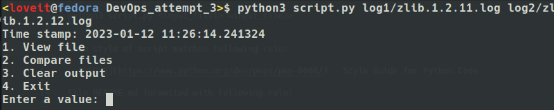
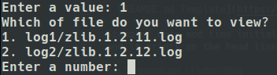
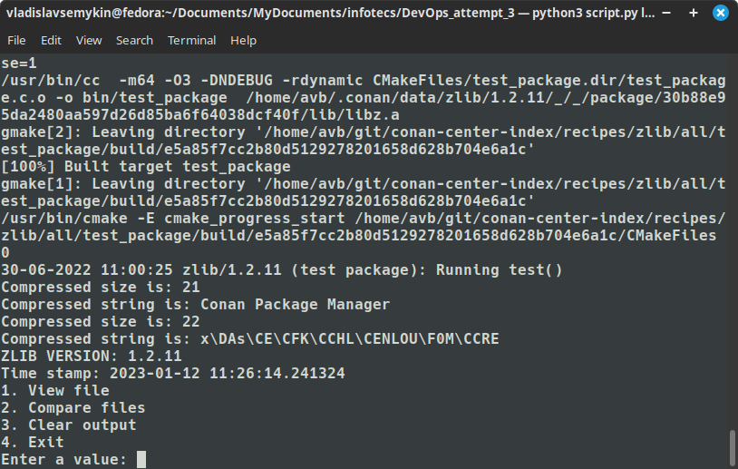
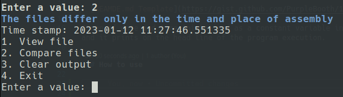
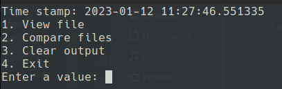
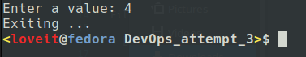
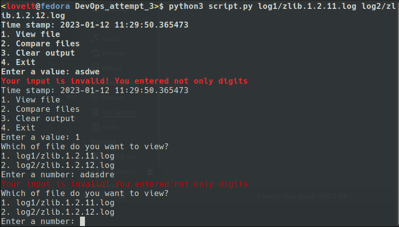
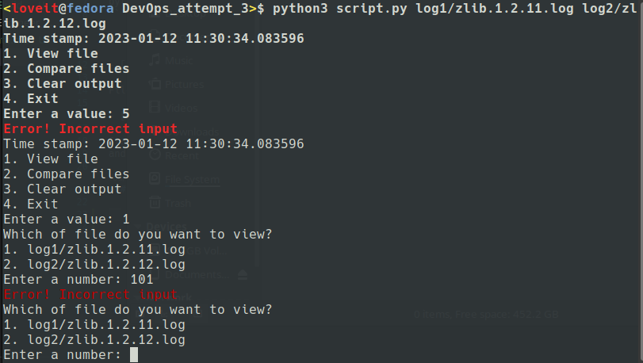

# DevOps_infotecs_attempt3

The program is written in Python. It represents console application
with looped menu, which requires users input to CLI. Example:

```
python3 script.py <input_file1> <input_file2>
```

Code style of script matches following rule:

- [PEP 8](https://www.python.org/dev/peps/pep-0008/) - Style Guide for Python Code

File README.md formatted with following rule:

- [REAMDE.md template](https://gist.github.com/PurpleBooth/109311bb0361f32d87a2) - Correct, short and contentfull formatting

Stamp of date and time initialized as a constant variable in the script,
and it prints on the head line of the program execution.

### How to use

#### Iterating in the menu

General view of menu



Enter a '1' value



Example of viewing a file



Enter a '2' value



Enter a '3' value



Enter a '4' value



#### Handling errors

Entering a string instead of the number



Entering incorrect number



Recursive link on this repo:
[DevOps Task](https://github.com/ViNN280801/DevOps_infotecs_attempt3#how-to-use)
